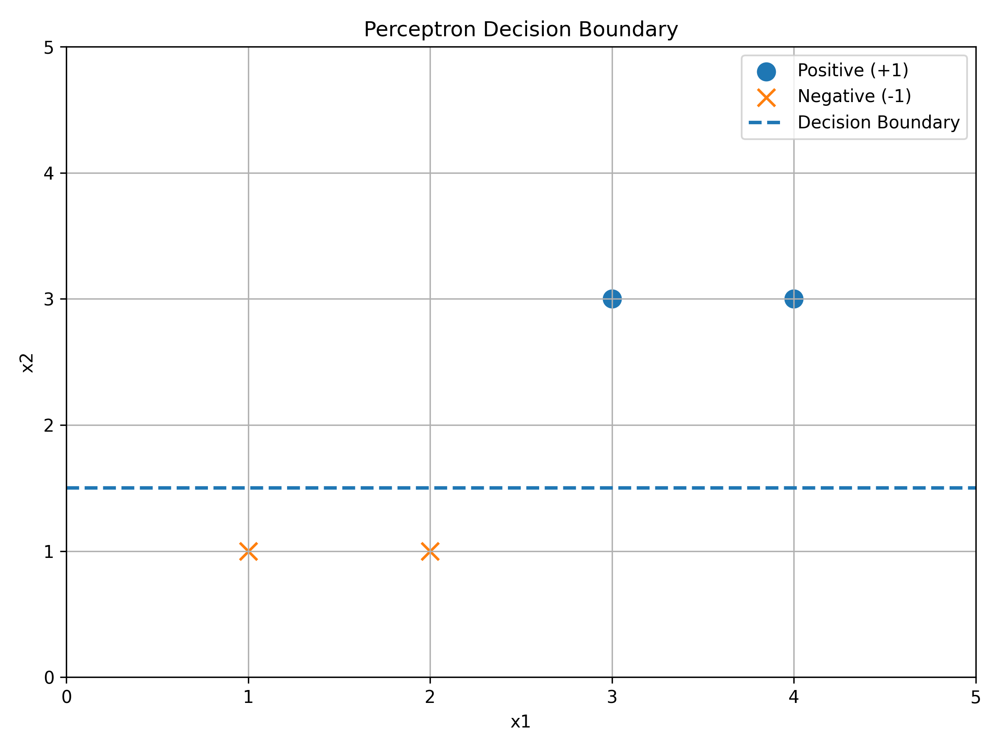
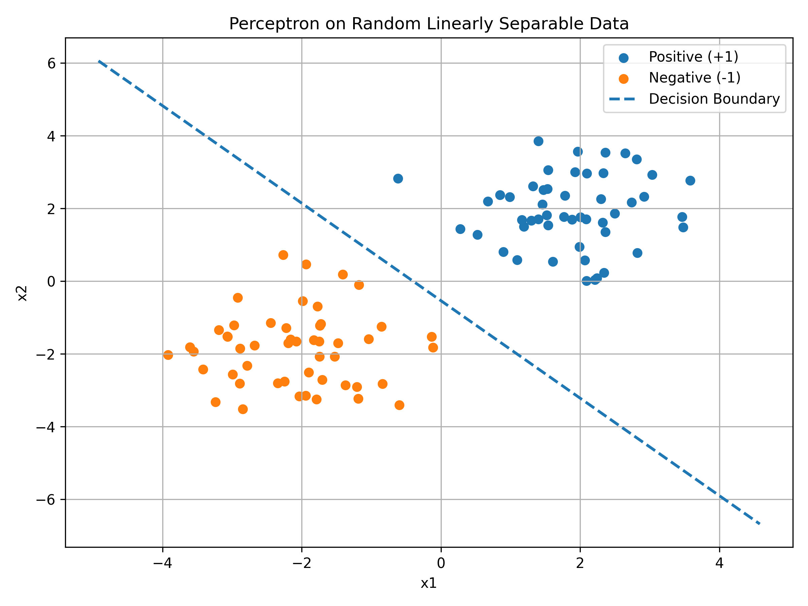
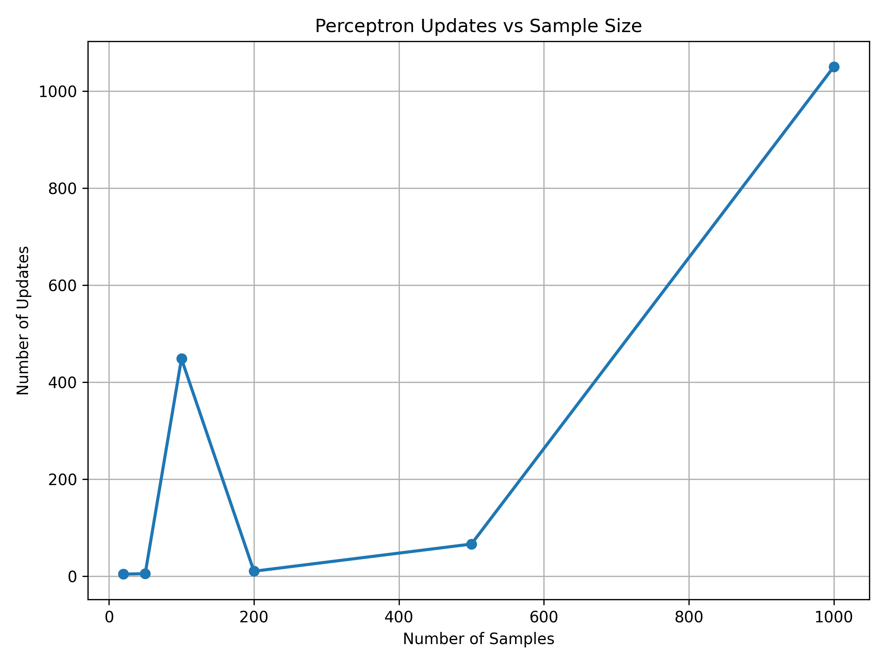
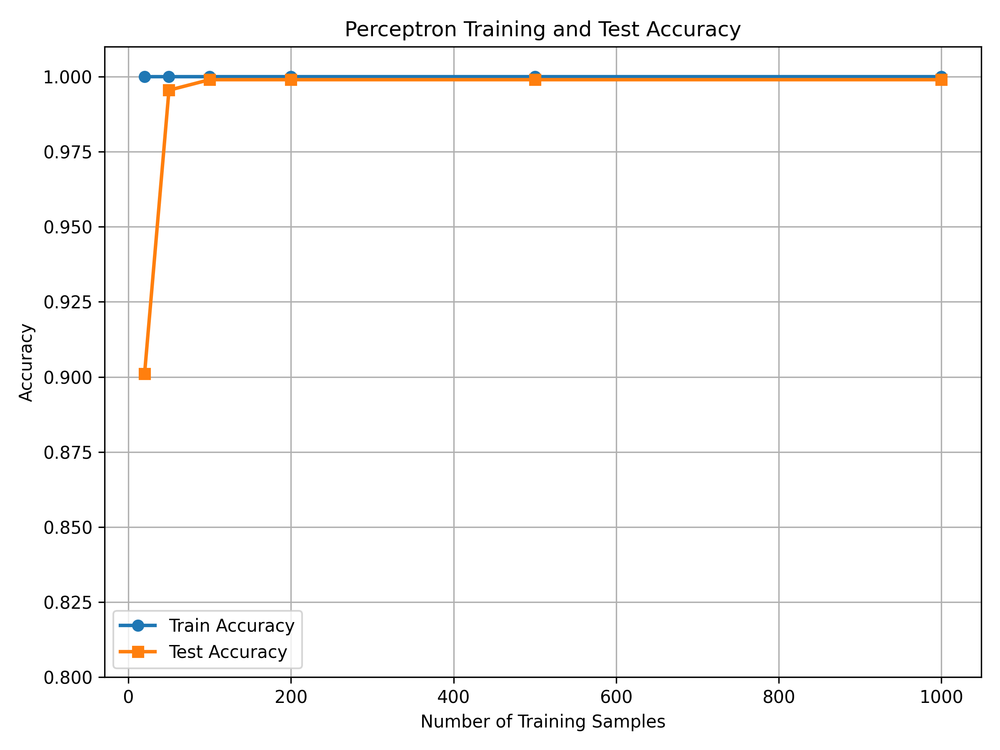
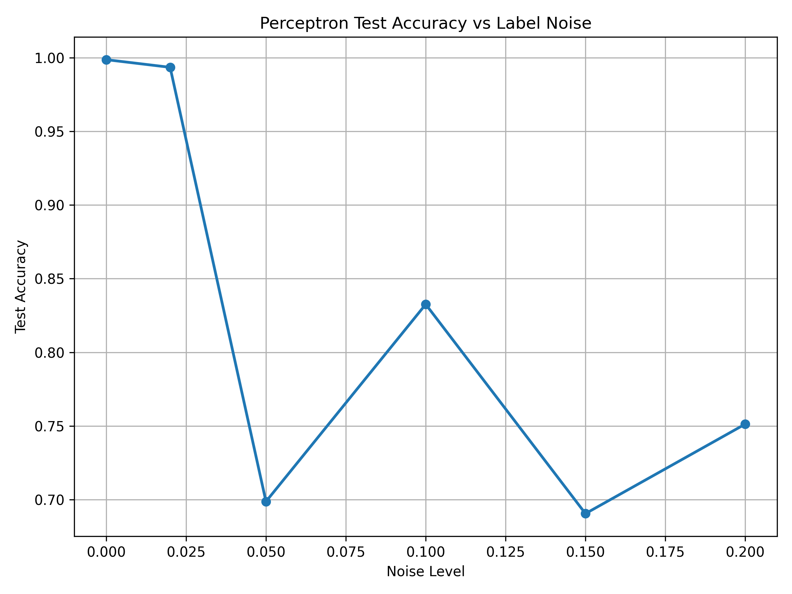

# Perceptron from Statistical Learning

> A from-scratch implementation of the Perceptron algorithm based on Li Hang's *Statistical Learning Methods*, including primal and dual forms, experiments, visualization, and label-noise analysis.




本项目基于李航《统计学习方法》中的感知机（Perceptron）算法，从理论、算法实现到实验验证，完整实现经典感知机模型。

项目不仅实现感知机的**原始形式与对偶形式**，还设计随机数据、样本规模、训练测试集以及标签噪声实验，用于研究感知机的训练过程、收敛性质和泛化表现。

---

## Key Features

- 从零实现感知机原始形式
- 从零实现感知机对偶形式
- 使用 Gram 矩阵实现对偶形式计算
- 实现二维分类决策边界可视化
- 研究样本数量对参数更新次数的影响
- 进行训练集 / 测试集实验
- 研究标签噪声对感知机收敛性的影响
- 使用 NumPy 和 Matplotlib 完成算法实现与实验分析
- 使用 Git 进行版本管理，并通过 GitHub 管理项目

---

## 1. Project Motivation

感知机是经典的线性二分类模型，也是理解机器学习分类算法的重要基础。

本项目没有直接调用 `sklearn` 等高级机器学习库，而是从零实现感知机算法，通过数学推导、代码实现和实验验证理解模型内部机制。

重点研究以下问题：

- 感知机如何通过误分类样本更新参数？
- 为什么感知机在线性可分数据上能够收敛？
- 原始形式与对偶形式有什么区别？
- Gram 矩阵在对偶形式中有什么作用？
- 样本数量如何影响模型训练？
- 标签噪声如何影响感知机的收敛性？
- 训练数据的线性可分性与模型泛化表现之间有什么关系？

---

# 2. Perceptron Algorithm

## 2.1 Problem Definition

给定训练数据：

$$
D=\{(x_i,y_i)\}_{i=1}^{N}
$$

其中：

$$
x_i\in\mathbb{R}^d,\qquad y_i\in\{-1,+1\}
$$

感知机希望找到一个线性分类超平面：

$$
w^T x+b=0
$$

将两个类别的样本分开。

---

## 2.2 Primal Form

感知机直接维护参数：

$$
w,b
$$

对于第 $i$ 个训练样本，如果：

$$
y_i(w^T x_i+b)\leq0
$$

则认为该样本被错误分类，并进行参数更新：

$$
w\leftarrow w+y_i x_i
$$

$$
b\leftarrow b+y_i
$$

模型的预测函数为：

$$
\hat{y}=\mathrm{sign}(w^T x+b)
$$

重复这一过程，直到所有训练样本均被正确分类。

本项目在：

```text
src/perceptron_original.py
```

中实现感知机原始形式。

---

## 2.3 Dual Form

感知机还可以使用对偶形式表示：

$$
w=\sum_{i=1}^{N}\alpha_i y_i x_i
$$

其中 $\alpha_i$ 表示第 $i$ 个样本参与参数更新的次数。

将其代入分类函数：

$$
w^T x+b = \sum_{j=1}^{N}\alpha_j y_j x_j^T x+b
$$

因此：

$$
f(x)= \sum_{j=1}^{N}\alpha_j y_j(x_j^T x)+b
$$

为了提高计算效率，可以预先计算 Gram 矩阵：

$$
G_{ij}=x_i^T x_j
$$

即：

$$
G=XX^T
$$

因此，在训练过程中可以通过 Gram 矩阵计算样本之间的内积。

本项目在：

```text
src/perceptron_dual.py
```

中实现感知机对偶形式。

---

# 3. Workflow

```text
Input Data
     ↓
Initialize w, b
     ↓
Check y(wᵀx + b)
     ↓
Misclassified?
    ↙        ↘
  Yes         No
   ↓           ↓
Update      Continue
   ↓
Convergence?
   ↓
Prediction
   ↓
Evaluation
```

核心训练过程可以概括为：

$$
y_i(w^T x_i+b)\leq0
\quad\Rightarrow\quad
(w,b)\text{ update}
$$

---

# 4. Project Structure

```text
perceptron-from-statistical-learning/
│
├── README.md
├── .gitignore
│
├── src/
│   ├── perceptron_original.py
│   └── perceptron_dual.py
│
├── experiments/
│   ├── experiments.py
│   ├── experiment_random.py
│   ├── experiment_sample_size.py
│   ├── experiment_train_test.py
│   └── experiment_noise.py
│
├── notebooks/
│
└── results/
    └── figures/
        ├── perceptron_boundary.png
        ├── random_dataset.png
        ├── updates_vs_sample_size.png
        ├── train_test_accuracy.png
        └── accuracy_vs_noise.png
```

---

# 5. Experiments

## 5.1 Basic Experiment

首先使用简单的二维线性可分数据：

```python
X = np.array([
    [3, 3],
    [4, 3],
    [1, 1],
    [2, 1]
])

y = np.array([1, 1, -1, -1])
```

训练得到：

```text
w = [0. 4.]
b = -6
```

因此决策边界为：

$$
4x_2-6=0
$$

即：

$$
x_2=1.5
$$

模型能够正确分类全部训练样本。

---

## 5.2 Random Dataset Experiment

为了验证感知机在随机线性可分数据上的表现，生成二维随机数据集，并记录：

- 参数 $w$
- 偏置 $b$
- Epoch 数
- 参数更新次数
- 分类准确率

实验代码：

```text
experiments/experiment_random.py
```

实验结果：



---

## 5.3 Sample Size Experiment

通过改变训练样本数量，研究样本规模对感知机训练过程的影响。

重点考察：

$$
\mathrm{Sample\ Size}
\rightarrow
\mathrm{Number\ of\ Updates}
$$

实验代码：

```text
experiments/experiment_sample_size.py
```

实验结果：



该实验主要用于观察样本规模变化与感知机参数更新次数之间的关系。

---

## 5.4 Train / Test Experiment

进一步将数据划分为训练集和测试集。

训练过程为：

$$
X_{train},y_{train}
\rightarrow
\mathrm{Perceptron}
\rightarrow
(w,b)
$$

模型训练完成后，在测试集上进行预测：

$$
\hat{y}=\mathrm{sign}(w^T x+b)
$$

分别计算训练集和测试集准确率：

$$
Accuracy_{train}
$$

$$
Accuracy_{test}
$$

用于观察模型的泛化表现。

实验代码：

```text
experiments/experiment_train_test.py
```

实验结果：



---

# 6. Label Noise Experiment

为了研究数据不再严格线性可分时感知机的表现，在训练集中随机翻转一定比例的标签。

噪声水平设置为：

```text
0%
2%
5%
10%
15%
20%
```

标签翻转过程：

```python
y_train[noise_indices] *= -1
```

---

## 6.1 Experimental Results

| Noise | Epochs | Updates | Train Accuracy | Test Accuracy |
|---:|---:|---:|---:|---:|
| 0% | 3 | 44 | 1.0000 | 0.9988 |
| 2% | 1000 | 47226 | 0.9740 | 0.9936 |
| 5% | 1000 | 87023 | 0.6900 | 0.6986 |
| 10% | 1000 | 126359 | 0.7760 | 0.8326 |
| 15% | 1000 | 138545 | 0.6260 | 0.6904 |
| 20% | 1000 | 178312 | 0.6640 | 0.7512 |

实验结果：



---

## 6.2 Experimental Analysis

当噪声为 0% 时，训练数据保持线性可分，因此感知机能够正常收敛。

当加入标签噪声后，训练数据通常不再严格线性可分。此时不存在一个参数组合能够同时满足所有样本：

$$
y_i(w^T x_i+b)>0
$$

因此感知机可能持续发现误分类样本并不断更新参数。

实验中可以观察到，加入少量噪声后，参数更新次数大幅增加。

例如：

```text
Noise = 0%
Updates = 44
```

而：

```text
Noise = 2%
Updates = 47226
```

这说明即使少量标签噪声不会立即导致测试准确率大幅下降，也可能显著影响感知机的训练过程和收敛行为。

需要注意的是，当：

```text
Epochs = 1000
```

时，表示模型达到实验中设置的最大训练轮数，并不代表算法已经收敛。

---

# 7. Results

本项目主要从三个方面观察感知机的行为：

### 1. Classification

在二维线性可分数据上，感知机能够学习线性分类边界。


### 2. Training Behavior

样本规模的变化会影响感知机的参数更新过程。


### 3. Noise and Convergence

随着标签噪声增加，训练数据的线性可分性受到破坏，感知机的参数更新次数显著增加，并可能无法在有限训练轮数内收敛。


---

# 8. How to Run

首先进入项目目录：

```bash
cd perceptron-from-statistical-learning
```

安装依赖：

```bash
pip install numpy matplotlib
```

运行基础实验：

```bash
python experiments/experiments.py
```

运行随机数据实验：

```bash
python experiments/experiment_random.py
```

运行样本量实验：

```bash
python experiments/experiment_sample_size.py
```

运行训练集 / 测试集实验：

```bash
python experiments/experiment_train_test.py
```

运行标签噪声实验：

```bash
python experiments/experiment_noise.py
```

实验生成的图片会保存到：

```text
results/figures/
```

---

# 9. Tech Stack

- **Python** — Algorithm implementation
- **NumPy** — Numerical computation
- **Matplotlib** — Data visualization
- **Git** — Version control
- **GitHub** — Project management and collaboration

---

# 10. Learning Reference

主要参考：

> 李航，《统计学习方法》，人民邮电出版社。

本项目主要对应《统计学习方法》中的感知机章节，并在理论实现基础上增加随机数据、样本规模、训练测试划分以及标签噪声实验，用于进一步理解算法的训练过程和收敛性质。

---

# 11. Future Extensions

后续可以进一步研究：

- Pocket Algorithm
- Kernel Perceptron
- Logistic Regression
- Support Vector Machine
- 不同优化算法之间的比较
- 更复杂的数据集
- 多分类感知机

---

## License

This project is for learning and research purposes.